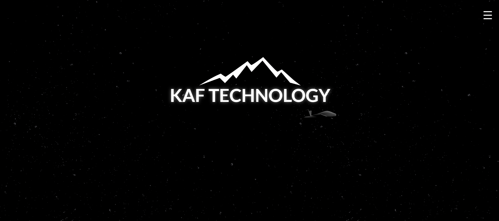
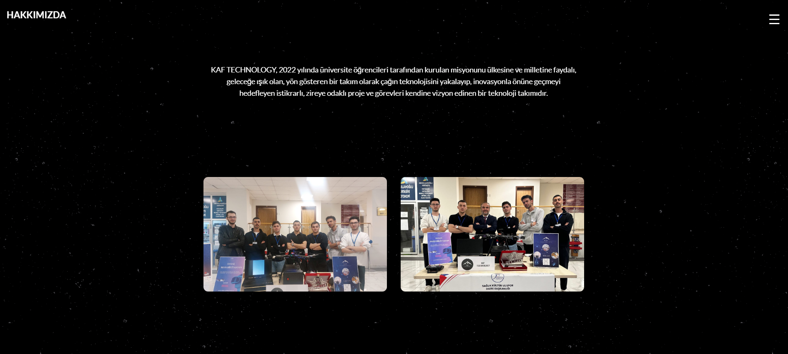
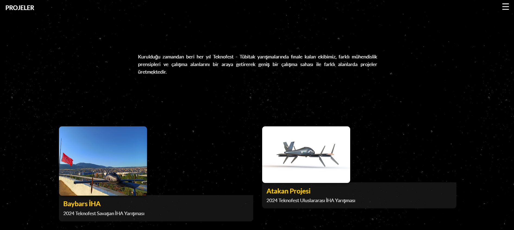
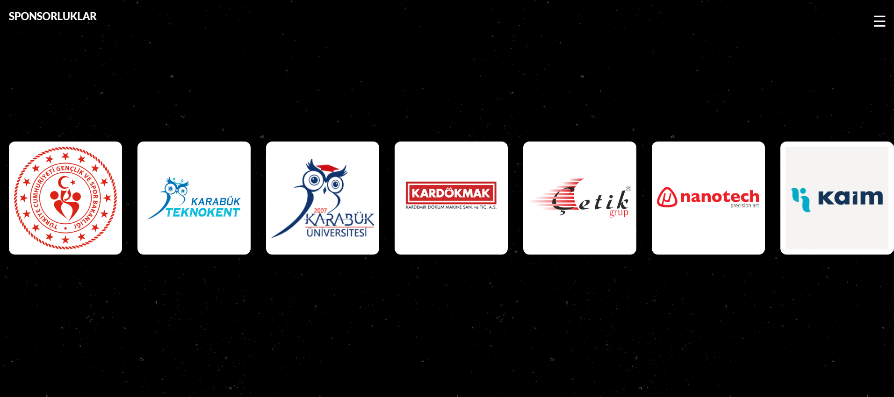
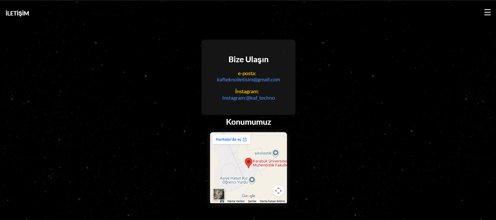

# 🚀 KAF TECHNOLOGY Web Sitesi

  

  <strong>Geleceğe yön veren, milli teknoloji hamlesine katkı sağlayan yenilikçi İHA ve teknoloji projeleri.</strong>

  
  
  

---

## 📌 Proje Hakkında

Bu repo, **KAF Technology** takımının vizyonunu, hayata geçirdiği insansız hava aracı (İHA) projelerini, ekip dinamiklerini, destekçi sponsorlarını ve iletişim kanallarını tanıtan resmi web sitesinin kaynak kodlarını içermektedir.

Uzay/derin tema (dark theme) konseptiyle tasarlanan web sitesi, modern arayüzü ve kullanıcı dostu yapısıyla takımın çalışmalarını geniş kitlelere ulaştırmayı hedefler.

---

## 🖼️ Ekran Görüntüleri ve Site Bölümleri

### 1. Ana Sayfa
Takımın simgesi ve felsefesini yansıtan karşılama ekranı.

  

---

### 2. Hakkımızda
> *"KAF TECHNOLOGY, 2022 yılında üniversite öğrencileri tarafından kurulan misyonunu ülkesine ve milletine faydalı, geleceğe ışık olan, yön gösteren bir takım olarak çağın teknolojisini yakalayıp, inovasyonla önüne geçmeyi hedefleyen istikrarlı, zirveye odaklı proje ve görevleri kendine vizyon edinen bir teknoloji takımıdır."*

  

---

### 3. Projelerimiz
Kurulduğu zamandan beri her yıl Teknofest ve TÜBİTAK yarışmalarında finale kalan ekibimiz; farklı mühendislik prensipleri ve çalışma alanlarını bir araya getirerek geniş bir çalışma sahası ile farklı alanlarda projeler üretmektedir:

* **Baybars İHA:** 2024 Teknofest Savaşan İHA Yarışması
* **Atakan Projesi:** 2024 Teknofest Uluslararası İHA Yarışması

  

---

### 4. Sponsorluklar & Destekçilerimiz
Yolculuğumuzda yanımızda olan ve çalışmalarımıza güç katan değerli paydaşlarımız:

* **T.C. Gençlik ve Spor Bakanlığı**
* **Karabük Teknokent**
* **Karabük Üniversitesi**
* **Kardökmak (Kardemir Döküm Makine San. ve Tic. A.Ş.)**
* **Çetik Grup**
* **Nanotech Precision Art**
* **KAİM**

  

---

### 5. İletişim & Konum
Takımımızla iş birliği, sponsorluk veya doğrudan temas için:

* 📍 **Konum:** Karabük Üniversitesi Mühendislik Fakültesi
* 📧 **E-posta:** [kafteknoiletisim@gmail.com](mailto:kafteknoiletisim@gmail.com)
* 📸 **Instagram:** [@kaf_techno](https://instagram.com/kaf_techno)

  

---
